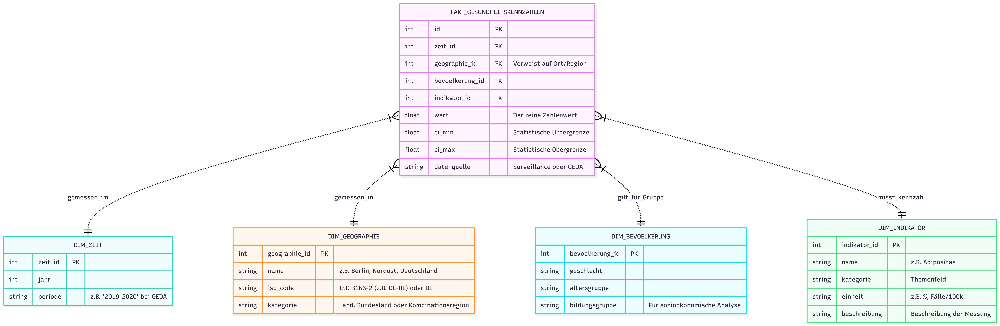
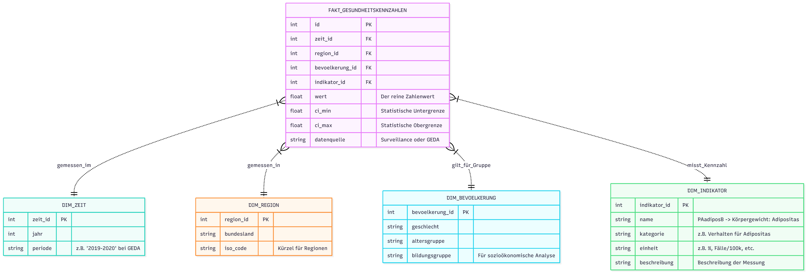

# Data-Warehouse-Projekt (Universitätsprojekt)

Dieses Repository enthält ein Data-Warehouse-Projekt, das im Rahmen eines Universitätskurses im Masterstudium **Medical Data Science** entwickelt wurde.

## Projektkontext
Ziel des Projekts ist die Planung und Umsetzung einer Data-Warehouse-Lösung, einschließlich Datenmodellierung und automatisierter ETL-Pipelines. Das Projekt dient **akademischen Zwecken** und wurde zu Lern- und Demonstrationszwecken erstellt.

## Datenquellen
Die verwendeten Rohdaten stammen aus öffentlich zugänglichen Quellen des **Robert Koch-Instituts (RKI)** im CSV- und TSV-Format.

## Umfang
- Analyse von Rohdaten zur Identifikation relevanter Felder und Strukturen  
- Konzeption eines Data-Warehouse-Schemas inkl. ER-Diagramm  
- Implementierung automatisierter ETL-Pipelines mit Python  
- Speicherung der bereinigten Daten in einer PostgreSQL-Datenbank  
- Geplante Integration von Power BI zur Datenanalyse und -visualisierung

## Status
Das Projekt ist **laufend**. Weitere Erweiterungen, einschließlich zusätzlicher Transformationen und Power-BI-Dashboards, sind geplant.

## ER-Diagramm

### Version 2 


**Änderung:** Dim_Region mit Dim_Geographie ersetzt. Grund dafür ist, dass die Quellen enthalten nicht nur Regionen sondern auch Ländern und Kombination von mehrere Regionen in Deutschland. (Info: https://github.com/robert-koch-institut/Diabetes-Surveillance/tree/main?tab=readme-ov-file#Regionalcodes)

### Version 1


## Architekturdiagramm

## Wichtige Befehle zum Ausführen

```cmd
docker compose up --build
docker compose down
````


