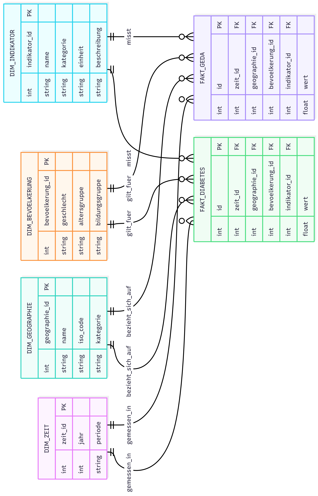
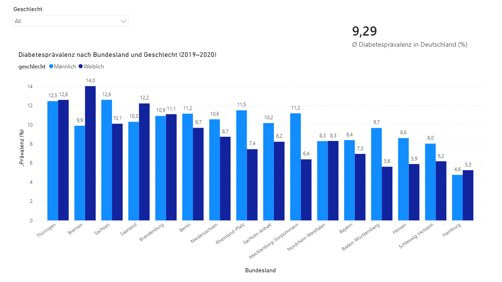
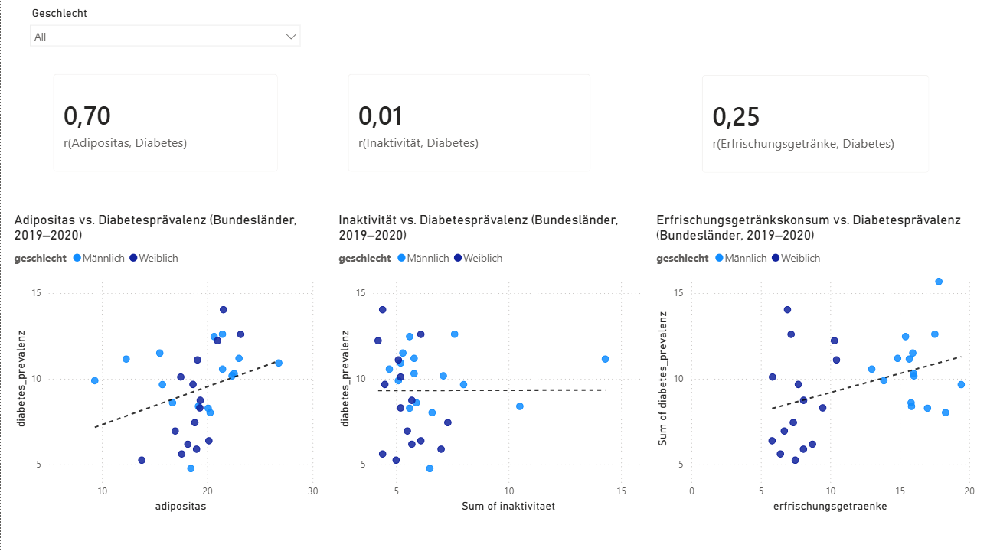
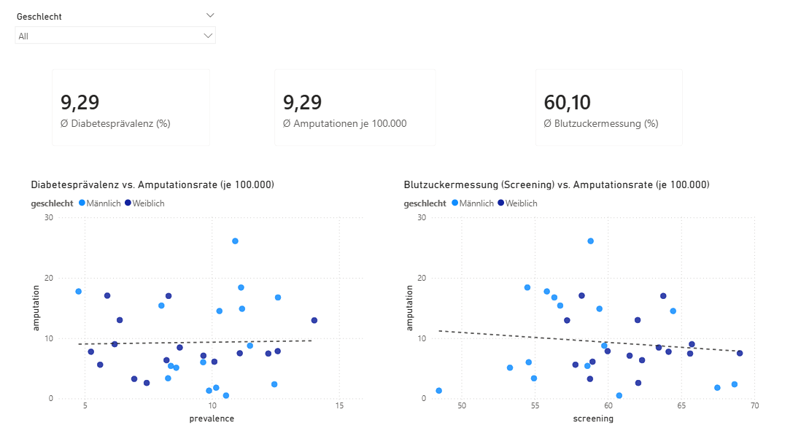

# Data-Warehouse-Projekt (Universitätsprojekt)

Dieses Repository enthält ein Data-Warehouse-Projekt, das im Rahmen eines Universitätskurses im Masterstudium **Medical Data Science** entwickelt wurde.

## Projektkontext
Ziel des Projekts ist die Planung und Umsetzung einer Data-Warehouse-Lösung, einschließlich Datenmodellierung und automatisierter ETL-Pipelines. Das Projekt dient **akademischen Zwecken** und wurde zu Lern- und Demonstrationszwecken erstellt.

## Datenquellen
Die verwendeten Rohdaten stammen aus öffentlich zugänglichen Repositorien des **Robert Koch-Institut (RKI)**:

1. Gesundheit in Deutschland Aktuell (GEDA)

    Quelle: [https://github.com/robert-koch-institut/Gesundheit_in_Deutschland_Aktuell](https://github.com/robert-koch-institut/Gesundheit_in_Deutschland_Aktuell)

    Lizenz: Creative Commons Attribution 4.0 International (CC BY 4.0) [https://creativecommons.org/licenses/by/4.0/](https://creativecommons.org/licenses/by/4.0/)

2. Diabetes-Surveillance

    Quelle: [https://github.com/robert-koch-institut/Diabetes-Surveillance](https://github.com/robert-koch-institut/Diabetes-Surveillance)
    
    Lizenz: Creative Commons Attribution 4.0 International (CC BY 4.0) [https://creativecommons.org/licenses/by/4.0/](https://creativecommons.org/licenses/by/4.0/)

Die Daten wurden im Rahmen dieses universitären Data-Warehouse-Projekts extrahiert, transformiert und in ein eigenes Datenbankschema überführt (ETL-Prozess). Dabei erfolgten insbesondere Bereinigungen, Strukturtransformationen sowie Aggregationen zur analytischen Auswertung.

Die inhaltliche Verantwortung für die Originaldaten liegt beim Robert Koch-Institut (RKI).

## Umfang
- Analyse von Rohdaten zur Identifikation relevanter Felder und Strukturen  
- Konzeption eines Data-Warehouse-Schemas inkl. ER-Diagramm  
- Implementierung automatisierter ETL-Pipelines mit Python  
- Speicherung der bereinigten Daten in einer PostgreSQL-Datenbank  
- Geplante Integration von Power BI zur Datenanalyse und -visualisierung

## ER-Diagramm



## Visualisierung





## Wichtige Befehle zum Ausführen

```cmd
docker compose up --build
docker compose up --build service_name
docker compose down
````


